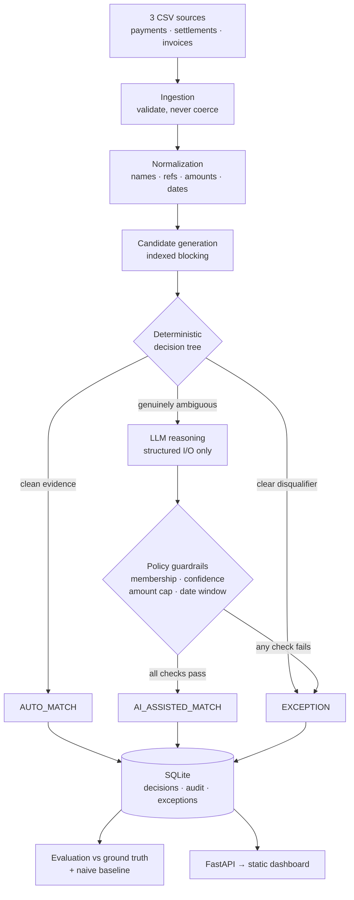
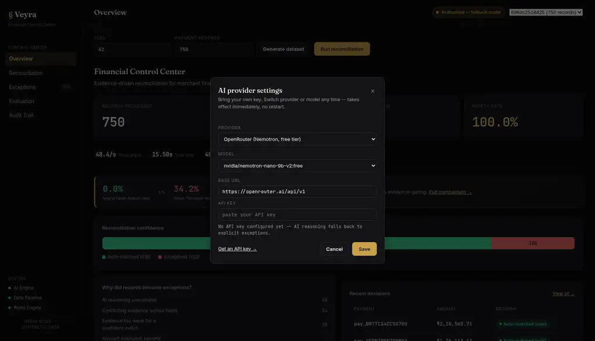

<div align="center">

# Veyra

### Financial reconciliation, with evidence.

**Match what you can prove. Surface what you can't.**

[](https://www.python.org/)
[](https://fastapi.tiangolo.com/)
[](web/)
[](#verification)
[](#live-ai-verified-against-a-real-provider)
[](LICENSE)

Reconciles **payment-gateway transactions** against **bank settlement records**, using **internal invoices**
as corroborating evidence. Deterministic rules decide everything provable from facts; an LLM is consulted
only for the genuinely ambiguous minority; a non-negotiable policy layer re-validates every AI proposal
before it can become a financial decision.

*Built for Razorpay Buildathon 2026 — Track 04: AI Finance Controller*


</div>

---

## Results at a glance

Same 750-record dataset, same evaluation function, three configurations:

| Metric | **Veyra** (deterministic) | **Veyra** + live LLM | Naive "closest-amount" matcher |
|:---|:---:|:---:|:---:|
| Automation precision | **100.0%** | **100.0%** | 64.7% |
| Coverage / recall | 95.4% | **99.5%** | 74.2% |
| Safety rate <sub>(correctly refuses the unresolvable)</sub> | **100.0%** | **100.0%** | 6.9% |
| False-match rate | **0.0%** | **0.0%** | 35.3% |
| Unsafe / incorrect auto-matches | **0 / 0** | **0 / 0** | 95 / 167 |

A naive fuzzy-matcher is confidently **wrong more than a third of the time it automates**. Veyra automates
82.4% of the batch with **zero** false or unsafe matches — and shows its evidence for every one.

> **The core bet:** a false financial match costs far more than an unresolved one. Money reconciled against
> the wrong transaction is a real loss; a delayed review is an inconvenience. Every design decision here
> optimizes for **precision and safety over raw automation rate**.

---

## Quick start

```bash
git clone https://github.com/Vishnu-3727/Veyra---FIntech.git
cd Veyra---FIntech
./run.sh                      # → http://127.0.0.1:8501
```

One command: creates a virtualenv, installs dependencies, seeds `.env`, starts the API on `:8000` and the
static dashboard on `:8501`. No key required — without one, ambiguous cases become explicit
`AI_UNAVAILABLE` exceptions instead of guesses.

<details>
<summary><b>Enable live AI reasoning</b> (optional, ~30 seconds)</summary>

<br>

**Easiest:** click the **AI status pill** (top right of the dashboard) → pick a provider → paste a key →
**Save**. Takes effect on the next run; a run already in flight keeps the configuration it started with.
No restart, no file editing.

**Or via `.env`:**

```bash
LLM_API_KEY=your-key-here
LLM_BASE_URL=https://integrate.api.nvidia.com/v1   # any OpenAI-compatible endpoint
LLM_MODEL=nvidia/nemotron-3-super-120b-a12b
```

The key is never echoed by any API response (only a masked last-4 hint), is sent in a JSON body rather
than a query string so it never lands in a URL log, and is never persisted into run history.

</details>

<details>
<summary><b>Ports, re-runs and failure modes</b></summary>

<br>

`run.sh` is **idempotent**: if a healthy API from a previous launch is still on the port, it is reused
instead of failing with "address already in use". A genuine port conflict fails fast with a clear message
(`API_PORT=8001 ./run.sh` / `DASHBOARD_PORT=8502 ./run.sh`).

It also **fails closed**: if the API it started never reports healthy (import error, occupied port, crash
during startup) it prints the failure with a `uvicorn app.api:app` repro hint, stops the process it
started, and exits non-zero *without* serving a dashboard whose every request would fail.

`API_PORT`/`DASHBOARD_PORT` are exported to the API process, so the CORS default follows the dashboard port
actually in use — `DASHBOARD_PORT=8502 ./run.sh` needs no separate `CORS_ALLOWED_ORIGINS`. An explicit
value always wins.

</details>

---

## Table of contents

| | |
|:---|:---|
| [The problem](#the-problem) | [Measured results](#measured-results) |
| [How it works](#how-it-works) | [Live AI](#live-ai-verified-against-a-real-provider) |
| [How the AI is constrained](#how-the-ai-is-constrained) | [Screenshots](#screenshots) |
| [The dataset](#the-synthetic-dataset) | [Usage](#usage) |
| [Evaluation & baseline](#measured-results) | [Verification](#verification) |
| [Performance](#performance-and-scaling) | [Known limitations](#known-limitations) |
| [Demo flow](#recommended-demo-flow) | [Project layout](#project-layout) |

---

## The problem

A payment gateway says money moved. The bank says something settled. The ledger says an invoice exists.
Reconciling those three sources is the classic, high-stakes finance-ops workflow — and it fails in
mundane ways: names abbreviate, references get truncated, settlements lag, banks double-post, amounts
drift by a fee, records simply never arrive.

Most of it is mechanical. Some of it is genuinely undecidable from the evidence available. **The hard part
is knowing which is which** — and never quietly pretending the second kind is the first.

**What Veyra closes:** it separates safely-automatable matches from unresolved exceptions, preserves the
evidence for both, and makes every decision auditable and attributable.

---

## How it works



1. **Candidate generation** — for each payment, find settlement rows inside the window (0–7 days) and
   amount tolerance (15%), **or** carrying a strong reference trace regardless of amount, so a
   mismatched-amount fraud/error case surfaces instead of vanishing. A name-similarity floor stops two
   unrelated customers who coincidentally paid the same round amount from looking like candidates.
2. **Duplicate collapsing** — candidates sharing a UTR (a genuine bank double-post) collapse to one
   canonical candidate, so a duplicate is *flagged*, not double-counted or confused with real ambiguity.
3. **Deterministic decision tree** — a single dominant candidate with exact reference and exact amount is
   auto-matched with zero AI involvement, **but only if its settlement date is inside the window**. An
   exact reference whose date falls outside is conflicting evidence, not a clean match.
4. **AI only for ambiguity** (~6% of records) — the model receives precomputed, trustworthy features and
   must return strict JSON. It is explicitly instructed to decline when evidence is contested.
5. **Policy guardrails** — the safety boundary. An AI `MATCH` is honored only if the candidate it names is
   in the evaluated set, confidence ≥ 75/100, amount mismatch ≤ 8%, **and** the date is in the window —
   *regardless of how confident the model claims to be*. Fail any check → explicit exception.

<details>
<summary><b>The remaining six guarantees</b> — exceptions, audit, snapshots, run lifecycle, frozen AI config, invoices</summary>

<br>

6. **Exception management** (`app/exceptions.py`) — every unresolved case records what was attempted, what
   evidence was found (**including rejected candidates**), what conflicted, why it couldn't be resolved,
   and a concrete suggested next action for a human reviewer.

7. **Audit trail** (`audit_log`) — every decision, matched or excepted, gets an append-only record of the
   source payment, the actor (rule engine / AI-assisted / policy guardrail / validator / human reviewer),
   the evidence, the confidence and a timestamp. This is an append-only *application* log (inserts only,
   never updated or deleted) — **not** a cryptographically-verified or WORM-backed ledger, and it isn't
   described as one. Marking an exception reviewed appends its own `human_reviewer` /
   `EXCEPTION_REVIEWED` event and leaves the engine's decision untouched, so the trail reads
   **engine decision → exception → human reviewed**. The action is idempotent: a double-click records
   exactly one review event.

8. **Invoice corroboration** — independent of the bank match, each payment is checked against the invoice
   ledger (order id + amount tolerance) as secondary evidence, reported per-decision as
   `found_consistent` / `found_mismatch` / `not_found` / `ambiguous` (more than one invoice shares the
   order id) / `record_invalid` (an invoice exists but failed source validation — a different fact from
   "no invoice").

9. **Per-run source snapshots** — the live source tables hold only the current batch, so each run also
   snapshots all three sources (`run_payments`, `run_bank_settlements`, `run_invoices`) plus the ground
   truth it was scored against (`run_ground_truth`), and records a `dataset_fingerprint` (sha256 over the
   ordered source files) with the generator's `seed`/`size`. A completed run is therefore
   **self-contained**: decisions, exceptions, audit trail, evaluation *and* its naive-baseline comparison
   all point back to the same `run_id` and the same data, no matter what is generated on disk later.

10. **Durable run lifecycle** — a `runs` row is written at batch START as `RUNNING` and updated to
    `COMPLETED` or `FAILED` at the end. A crash mid-batch leaves an honest `RUNNING`/`FAILED` record
    rather than orphaned decisions pointing at a `run_id` with no run.

11. **Frozen AI configuration per run** — provider/base-url/model/key are snapshotted at run start and
    used for every call in that batch (only `provider`, `model`, `timeout` are recorded; the raw key never
    leaves memory). Changing settings mid-batch affects the *next* run, so one batch can never be split
    across two providers and its metrics stay interpretable.

</details>

<details>
<summary><b>Module map</b> — what each file owns</summary>

<br>

```
generate_dataset.py   seeded 3-source dataset + ground truth (atomic, reproducible)
        ↓
ingestion.py          CSV → SQLite; validates required fields, never silently coerces bad data
        ↓
normalization.py      pure functions: name/ref normalization, amount/date parsing, fuzzy similarity
        ↓
candidates.py         blocking via per-batch index (date buckets + amount bisect + ref trigrams)
        ↓
scoring.py            deterministic decision tree → AUTO_MATCH / NEEDS_AI / EXCEPTION
        ↓
ai_reasoning.py       LLM call for ambiguous cases only; narrow, structured, watchdog-bounded
settings.py           runtime-configurable provider/key/model — changeable live, no restart
policy.py             hard guardrails: AI can propose, never unilaterally decide
exceptions.py         structures every unresolved case for a human reviewer
        ↓
pipeline.py           orchestration + persistence (decisions / audit_log / exceptions)
        ↓
evaluation.py         scores decisions against ground truth (never seen by the engine)
baseline.py           naive-matcher comparison, scored with the identical function
        ↓
api.py (FastAPI) ←→ web/ (static HTML/CSS/JS, zero build step)
```

Every box is small and independently testable. No queues, no vector DB, no agent framework, no frontend
build pipeline — a single SQLite file and ~12 focused Python modules reconcile 750 records in ~0.4 s and
10,000 in ~37 s on one core.

</details>

<details>
<summary><b>Why a hand-built frontend instead of Streamlit</b></summary>

<br>

Streamlit is excellent for internal tools, but every Streamlit app shares the same sidebar-plus-widgets
skeleton and default theme — instantly recognizable, and forgettable in a room full of hackathon demos.

`web/` is vanilla HTML/CSS/JS (no React, no bundler, no `npm install`) talking to the same FastAPI backend
over `fetch()`: a landing screen with live numbers, a fixed control-room sidebar (Overview /
Reconciliation / Exceptions / Evaluation / Audit Trail + system status), and a slide-over **evidence
checklist drawer** — amount / date / customer / reference each marked ✓ / ! / ✕ against the engine's
*actual* thresholds, with a plain-language verdict ("Match approved" / "Automation blocked") — instead of
a raw `st.json()` dump. Styled as a financial control room: warm near-black audit-ledger palette, serif
display face for headings, monospace for every number and identifier. Chart.js is vendored locally, so a
blocked CDN cannot take the dashboard down.

</details>

---

## How the AI is constrained

| Constraint | Implementation |
|:---|:---|
| **Narrow scope** | Only the ambiguous minority reaches the LLM. Amounts, dates, duplicate IDs and thresholds are *always* deterministic. |
| **Trustworthy input** | The model sees precomputed features, not raw data to re-derive, and is instructed to decline (`NO_MATCH`) when evidence is contested. |
| **Strict output contract** | `decision` ∈ {`MATCH`,`NO_MATCH`}, `candidate_id` string-or-null (a `MATCH` must name one), `confidence` int 0–100, `risk_flags` list of strings — validated field-by-field before the policy layer sees it. |
| **No unilateral authority** | Every `MATCH` is re-verified against hard caps. A confident-but-wrong proposal becomes an `UNSUPPORTED_AI_DECISION` exception, never a silent match. |
| **Fails closed** | No key / timeout / network error → `AI_UNAVAILABLE`. Unparseable or schema-violating output → `UNSUPPORTED_AI_DECISION`. Both route to human review; the pipeline never guesses and never crashes. |
| **Bounded** | Circuit breaker (3 consecutive failures → rest of batch skips the network) plus a hard wall-clock watchdog, so one bad key cannot turn a 750-record batch into a multi-minute hang. |

A model that answers `"confidence": "high"`, `"candidate_id": []` or `"decision": "MAYBE"` produces a
schema violation — not a crash, and not a match. When the breaker trips, the dashboard shows an explicit
"AI provider stopped responding mid-batch" banner, never a silent slowdown.

<details>
<summary><b>Bring your own key</b> — switchable provider, live, no restart</summary>

<br>

`app/settings.py` owns the provider/key/model as mutable runtime state (persisted to SQLite, seeded from
`.env` on first boot). All presets are OpenAI-compatible chat-completions endpoints, so `ai_reasoning.py`
needs **zero** provider-specific code:

| Provider | Default model | Notes |
|:---|:---|:---|
| **OpenRouter** | `nvidia/nemotron-nano-9b-v2:free` | Free tier, just a signup |
| **NVIDIA NIM** | `nvidia/llama-3.1-nemotron-70b-instruct` | Direct from build.nvidia.com — *used for live verification* |
| OpenAI | `gpt-4o-mini` | |
| Groq | `llama-3.3-70b-versatile` | Fast inference |
| Custom | — | Any other OpenAI-compatible base URL + model |

Keys are **provider-scoped**: a key is only valid for the provider that issued it, so changing provider
without supplying a new key clears the stored key (AI falls back to the safe "unavailable" path until a
new one is entered) — the Settings panel warns before you save. Changing only the *model* within the same
provider keeps the key. A key supplied purely through `.env` is adopted only for the provider that `.env`
describes, never carried across.

`GET /settings` returns the current non-secret config plus the preset catalog; `POST /settings` updates it
(all fields optional; omit `api_key` to keep the existing one).

### Data privacy

With live AI enabled the provider receives the *synthetic* fields constituting reconciliation evidence:
`customer_name`, `order_id`, payment `amount`, `description`, and per candidate its `bank_narration` /
`bank_payer_name` plus precomputed feature scores. **`customer_email` is never included.** This dataset is
synthetic — the live AI path must not be pointed at real financial or personally-identifying data without
a provider/data-governance configuration you have actually vetted. Veyra makes no claim of production
privacy or compliance.

</details>

---

## Measured results

**750 payments · 764 bank rows · 757 invoices · seed 42.** Two configurations measured on the *same* data
with the *same* evaluator.

### Deterministic (no LLM — the reproducible default)

| Metric | Value |
|:---|:---|
| Automation precision | **100.0%** — 0 incorrect, 0 unsafe out of 618 auto-matches |
| Coverage / recall | **95.4%** of the 648 safely-resolvable cases |
| Safety rate | **100.0%** — all 102 genuinely unresolvable cases correctly excepted |
| False-match rate | **0.0%** |
| Auto-reconciled | 618 / 750 (82.4%) |
| Exceptions | 132 / 750, each with evidence + suggested action |
| Throughput | ~1,300–2,400 records/sec, single core |
| Batch time | 0.31–0.57 s for 750 records (`scripts/benchmark.py`) |

This table needs no credential and reproduces byte-identically — which is why it is the headline. The 48
AI-eligible cases (reference variations, small amount mismatches, weak-name-but-exact-amount) become
`AI_UNAVAILABLE` exceptions rather than guesses.

### Live AI: verified against a real provider

**NVIDIA NIM · `nvidia/nemotron-3-super-120b-a12b` · 48 real HTTPS chat completions.**

| Metric | No LLM | **Live LLM** |
|:---|:---:|:---:|
| Automation precision | 100.0% | **100.0%** |
| Coverage / recall | 95.37% | **99.54%** |
| Safety rate | 100.0% | **100.0%** |
| False-match rate | 0.0% | **0.0%** |
| `AUTO_MATCH` | 618 | 618 |
| `AI_ASSISTED_MATCH` | 0 | **27** |
| `EXCEPTION` | 132 | 105 |
| `MISSED_OPPORTUNITY` | 30 | **3** |
| `UNSAFE_AUTO` / `INCORRECT_AUTO` | 0 / 0 | **0 / 0** |
| Batch wall time | ~0.4 s | 319 s *(network-bound)* |

Of the 48 real calls: **27** produced a policy-approved `AI_ASSISTED_MATCH`, **15** were the model
*declining* on genuinely indistinguishable candidate pairs (correctly routed to human review), and **6**
were real provider failures (`503 Service temporarily overloaded`, 20 s hard timeouts) that failed closed
to `AI_UNAVAILABLE`. Zero schema violations; zero policy rejections needed.

A representative approved match, end to end: the model named `bnk_QAKOIXNTM9TM` — present in the evaluated
3-candidate set ✓ — amount difference 1.33% (cap 8%) ✓, settlement date +2 days (window 0–7) ✓,
self-reported confidence 85 (floor 75) ✓ → `AI_ASSISTED_MATCH`, audited as `actor=ai_assisted`.

> **The honest read.** The real model recovered 27 of the 30 cases the deterministic engine had to leave on
> the table, without a single unsafe match. That is **not** guaranteed by the model's good behaviour — it is
> guaranteed by the policy layer. A deliberately reckless stand-in that always endorsed the first candidate
> was measured on the same batch and produced **17 unsafe matches (safety 83.3%)**. The guardrails bound the
> *class* of AI error; they cannot make a bad model safe. **Judge the architecture on the guardrails, not on
> this model's score.**

<details>
<summary><b>Naive baseline comparison</b> — how the 64.7% / 35.3% figures are produced</summary>

<br>

To make evidence-gating *measurable* rather than asserted, a naive baseline is scored with the identical
evaluation function against the identical dataset. It always commits to the closest-amount bank record
within the settlement window: no reference check, no name evidence, no duplicate detection, no ambiguity
detection, no AI, no policy caps — i.e. exactly what "just fuzzy-match it" produces.

The baseline is **run-scoped**: `GET /baseline?run_id=<id>` computes it from the SAME run's source
snapshots that produced the decisions it is compared against, so selecting an old run never compares
"Veyra on dataset A" against "naive matcher on dataset B".

Equidistant amount ties are broken deterministically (lowest `bank_ref`), because a naive matcher has no
basis for choosing. This replaced a row-order-dependent tie-break that made the headline comparison
irreproducible — 191 of the naive matches are exact amount-distance ties, so their outcome genuinely *is*
arbitrary; the deterministic version just makes the arbitrariness a fixed property of the data.

</details>

<details>
<summary><b>Evaluation methodology</b> — the five outcomes and four formulas</summary>

<br>

Every ground-truth payment is classified along two independent axes: whether the system automated it, and
whether a correct answer was **determinable at all**. That yields five mutually exclusive outcomes:

| Outcome | Meaning |
|:---|:---|
| `CORRECT_AUTO` | Resolvable, matched, correct — the desired outcome. |
| `INCORRECT_AUTO` | Resolvable, matched, but the **wrong** record. A false match. |
| `UNSAFE_AUTO` | **Not** resolvable, but matched anyway. A safety violation — worse than `INCORRECT_AUTO`. |
| `MISSED_OPPORTUNITY` | Resolvable, but excepted. Safe, but a coverage loss. |
| `CORRECTLY_ESCALATED` | Not resolvable, correctly excepted. |

```
automation precision = CORRECT_AUTO / (CORRECT_AUTO + INCORRECT_AUTO + UNSAFE_AUTO)
coverage / recall    = CORRECT_AUTO / resolvable_total
safety rate          = CORRECTLY_ESCALATED / unresolvable_total
false-match rate     = (INCORRECT_AUTO + UNSAFE_AUTO) / automated
```

Throughput and per-record latency are wall-clock measured around the actual batch, not estimated. The same
scoring function (`evaluation.score_decisions`) scores the naive baseline, so the two are directly
comparable. Record counts are reported transparently — source / evaluated / dropped-at-ingestion — so the
denominator is never ambiguous.

</details>

---

## Performance and scaling

| Payments | Bank rows | Full batch | Records/s | Candidate generation | Same, naive |
|---:|---:|---:|---:|---:|---:|
| 750 | 764 | 0.44 s | 1,691 | 0.16 s | 15.9 s |
| 1,500 | 1,510 | 1.39 s | 1,083 | 0.66 s | 79.1 s |
| 3,000 | 2,996 | 4.56 s | 658 | 2.54 s | *not run (~5 min projected)* |
| 5,000 | 4,982 | 10.9 s | 458 | 6.56 s | *not run* |
| 10,000 | 9,944 | 37.3 s | 268 | 25.1 s | *not run* |
| 20,000 | 19,928 | ~135 s | ~148 | ~93 s | *not run (hours, quadratic)* |

One core of a 12th-gen i5-1235U, AI disabled (no network variance), decisions committed per record. The
750-record batch went from **25.6 s to ~0.4 s** with **byte-identical decisions and metrics at every
size** — candidate generation alone is 85–120× faster where the naive version is still practical to run.

<details>
<summary><b>What changed, and the honest caveat on growth</b></summary>

<br>

Two behavior-preserving changes:

1. **Indexed candidate generation.** The old generator compared every payment against every bank row and
   paid for reference normalization plus fuzzy string work on each pair. `candidates.BankCandidateIndex`
   builds a per-batch index: settlement-date buckets kept sorted by amount and sliced with `bisect` for
   the amount band, plus a trigram inverted index over normalized reference text. The inclusion rule is
   unchanged — `tests/test_candidates.py` asserts the indexed generator returns the **same candidates,
   features and ordering** as the brute-force implementation for every payment of a full seeded dataset,
   plus deliberately garbled references.
2. **Transaction shape.** The pipeline no longer holds one write transaction across the whole batch (which
   also meant holding SQLite's write lock across every LLM call). Source data is read up front; each
   decision commits in its own short transaction (decision + audit event + exception, atomically); WAL
   mode keeps dashboard reads unblocked by the writer.

Repeat runs vary from 0.31 s (warm) to 0.57 s (cold page cache) at the smallest size — thermal,
scheduling and I/O noise, not algorithmic change. The decision counts and evaluation metrics never move.

**Growth is sub-quadratic but not linear:** reference-trigram posting lists densify as the dataset grows,
so per-payment verification work still rises (0.16 s at 750 vs ~93 s at 20,000). `POST /dataset/generate`
therefore caps size at `MAX_DATASET_SIZE` (10,000, a ~37 s batch) so an HTTP request cannot hang for
minutes; 20,000 completes in ~135 s via the CLI. Beyond that is a real-database, partitioned-batch
problem — not a threshold change.

</details>

---

## The synthetic dataset

`app/generate_dataset.py` produces `payments.csv`, `bank_settlements.csv`, `invoices.csv` and
`ground_truth.csv` from a single seeded `random.Random` and a fixed anchor date — fully reproducible
(`--seed 42 --size 750` regenerates byte-identical output, verified by matching `dataset_fingerprint`).

Generation is **atomic-with-validation**: it writes to a staging directory, validates every file
(existence, header, row counts, parseable summary), and only then promotes into the live raw directory
with `os.replace` — so a crash mid-generation leaves the previous valid dataset intact rather than a mixed
set of half-old, half-new CSVs.

**Ground truth is never read by the reconciliation engine** — only by `app/evaluation.py`, after the fact.

<details>
<summary><b>14 deliberately generated case types</b>, each with a documented resolvability judgment</summary>

<br>

| Case type | Share | Safely resolvable? |
|:---|:---:|:---|
| `exact_match` | 38% | yes |
| `name_variation`, `abbreviation`, `formatting_diff` | 20% | yes |
| `settlement_delay` (3–7 day lag) | 8% | yes |
| `reference_variation` (truncated/garbled ref) | 6% | yes |
| `duplicate_bank_record` (bank double-post) | 4% | yes |
| `amount_mismatch_small` (≤2%, fee-like) | 3% | yes |
| `missing_invoice` | 4% | yes (bank-match only) |
| `missing_fields` (blank field / corrupt amount) | 4% | mostly — corrupt-amount rows **no** |
| `amount_mismatch_large` (>15%, no explanation) | 3% | **no** |
| `missing_bank_record` (never settled) | 4% | **no** |
| `ambiguous_multiple_candidates` (2 indistinguishable) | 4% | **no** |
| `conflicting_evidence` (ref matches, amount wildly off) | 2% | **no** |

The `is_safely_resolvable` flag is what makes the safety rate meaningful: it encodes, per record, whether
*any* system — human or AI — could determine a unique correct answer from the evidence.

</details>

---

## Screenshots

| Landing | Overview |
|:---:|:---:|
|  |  |
| **Evidence checklist** (decision drawer) | **Exception queue** |
|  |  |
| **Evaluation vs. naive baseline** | **Audit trail** |
|  |  |
| **AI provider settings** (bring your own key) | |
|  | |

---

## Usage

### CLI (no dashboard)

```bash
source .venv/bin/activate
python cli.py generate --seed 42 --size 750   # synthetic dataset → data/raw/
python cli.py run                             # ingest + reconcile, prints metrics JSON
python cli.py evaluate                        # score the latest run against ground truth
python cli.py baseline                        # naive comparison on the SAME run's data
                                              #   --run-id <id> for a historical run
```

<details>
<summary><b>HTTP API</b></summary>

<br>

```bash
curl -X POST 'localhost:8000/dataset/generate?seed=42&size=750'
curl -X POST 'localhost:8000/reconcile/run'
curl 'localhost:8000/runs/latest'
curl 'localhost:8000/runs/<run_id>/evaluation'
curl 'localhost:8000/exceptions?run_id=<run_id>'
curl 'localhost:8000/decisions/<payment_id>?run_id=<run_id>'
curl 'localhost:8000/baseline?run_id=<run_id>'   # run-scoped; omit for the latest COMPLETED run
curl 'localhost:8000/settings'

# the API key goes in a JSON body, never a URL (URLs get logged by browsers and proxies)
curl -X POST localhost:8000/settings -H 'Content-Type: application/json' \
     -d '{"provider":"nvidia_nim","api_key":"..."}'
```

Every endpoint has bounded pagination and returns a `total` so the UI can state "N of M shown" rather than
implying a partial list is complete. An unknown `run_id` returns `404`, never another run's numbers.
Setting `API_AUTH_TOKEN` requires `X-API-Token` (or `Authorization: Bearer`) on everything except
`GET /health`; the dashboard then prompts for the token and keeps it in `sessionStorage` only.

</details>

---

## Verification

```bash
PYTEST_DISABLE_PLUGIN_AUTOLOAD=1 pytest tests/ -q    # 186 passing
python scripts/benchmark.py --sizes 750 1500 --oracle # reproducible performance numbers
python scripts/check_package.py                       # submission hygiene
```

**186 tests** cover: ingestion/validation (duplicate keys, non-finite amounts, preserved-but-invalid
rows), atomic dataset generation, candidate generation *including an equivalence proof between the indexed
and brute-force generators over full seeded datasets and garbled references*, the deterministic decision
tree, AI output-schema validation and policy guardrails, LLM transport behaviour, per-run AI-config
freezing, run lifecycle (`RUNNING`/`COMPLETED`/`FAILED`, plus a first-ever run against a database that
does not exist yet), provider/key precedence, evaluation and baseline reproducibility across regenerated
datasets, pipeline behaviour, and the API boundary (historical runs, unknown-run 404s, operation locking,
parameter bounds, auth, idempotent human review).

Tests never touch the network: `tests/conftest.py` disables AI by default, so a real key in `.env` cannot
turn the suite into live provider traffic. The `PYTEST_DISABLE_PLUGIN_AUTOLOAD` env-var works around
unrelated third-party pytest plugins that may be globally installed on the host; it is not required in a
clean environment.

`scripts/check_package.py` verifies no build artifacts, databases, generated config or secrets are
tracked, that every shippable source file **is** tracked, and reports the package file count and size.

---

## Recommended demo flow

*~4 minutes.*

1. **Landing screen** — real live numbers (records processed, precision, false-match rate), not
   placeholders, before you even click in.
2. **Overview** — four hero numbers, reconciliation-confidence bar, ranked exception reasons, recent
   decisions. The system is legible in ten seconds.
3. **Generate a fresh dataset live** (Generate dataset → Run reconciliation) to prove nothing is canned —
   under a second for 750 records, so it lands while you are still talking.
4. **Reconciliation view** — open an `exact_match` payment: the evidence checklist shows amount / date /
   customer / reference all ✓, verdict **"Match approved."**
5. **The same view, an exception** — open a `conflicting_evidence` case: reference ✓ but amount ✕ (28%
   off), verdict **"Automation blocked,"** with the exact reason. *This is the core safe-refusal moment.*
   Click **Mark reviewed** to record a real human-review action; the engine's decision is deliberately
   left unchanged.
6. **With a key configured** — show an `AI_ASSISTED_MATCH` decision's checklist and the model's own
   reasoning, then `evaluation.per_case_type.amount_mismatch_small` improving from `MISSED_OPPORTUNITY`
   to `CORRECT_AUTO`.
7. **Evaluation** — the outcome chart with zero red (`INCORRECT_AUTO`/`UNSAFE_AUTO`) bars, then the
   baseline table: 35.3% vs 0.0% false-match rate, same run, same data, same scoring. The single most
   convincing screen.
8. **Audit Trail** — filter by the payment id from step 4: terminal-style lines showing the engine's
   decision (actor, evidence, confidence) and, for the exception marked in step 5, the separate
   `HUMAN_REVIEWED` line. Provenance, not a mutated record.

---

## Known limitations

Stated plainly, because a finance-control product that hides its edges is not trustworthy.

<details open>
<summary><b>Live AI is verified — but a free tier is not reliable, and a model is not a guarantee</b></summary>

<br>

A real external completion has been observed end-to-end (NVIDIA NIM, `nvidia/nemotron-3-super-120b-a12b`,
48 real calls, 27 policy-approved matches). Four caveats remain:

- **6 of 48 calls failed** on that run (`503 Service temporarily overloaded`, 20 s hard timeouts). They
  failed closed to `AI_UNAVAILABLE`, which is correct — but expect a different AI-assisted count on any
  given run. **The deterministic numbers are the reproducible ones.**
- **Latency is network-bound**: the AI-enabled 750-record batch takes ~5 minutes versus ~0.4 s
  deterministic. That is a per-record LLM call on a free tier, not an engine regression.
- **Model access is account-scoped**: NVIDIA's `/v1/models` lists models a given credential cannot invoke
  (`404 … Not found for account`). If AI silently becomes unavailable, check the model, not the wiring —
  `LLM_MODEL` is the knob.
- **IPv6-hostile networks**: some networks advertise an IPv6 default route but black-hole IPv6 egress, and
  the SDK's HTTP client has no Happy Eyeballs race, so it burned the full connect timeout on an
  unreachable address (measured: 40.1 s dual-stack vs 0.04 s pinned). `LLM_FORCE_IPV4` (default on) pins
  the client to IPv4 and retries unpinned if that cannot connect. Transport only — it can never change a
  reconciliation decision.

</details>

- **Invoice corroboration is a secondary signal, deliberately.** Keyed on exact `order_id` and reported
  per-decision, it does **not** gate the primary payment↔bank decision: a severe invoice mismatch is shown
  explicitly as `invoice_status = found_mismatch` (never silently ignored), but it cannot override a sound
  bank match. Full three-way reconciliation that blocks on invoice disagreement is a product change with
  its own trade-offs.
- **The AI watchdog does not cancel the network call.** A timed-out `future.result(timeout=...)` bounds the
  *pipeline*, but the abandoned worker keeps running until its own client timeout fires — Python cannot
  interrupt a thread blocked in a socket read. Bounded by the fixed worker pool and the circuit breaker; a
  hard shutdown with a call in flight may wait up to `LLM_TIMEOUT_SECONDS`.
- **Single-process, single-machine.** No horizontal scaling. SQLite is sufficient at this volume, but a
  real database and a partitioned batch would be needed well before six-figure volumes.
- **Reference-trigram prefilter.** Exact and suffix reference matches are retrieved with a hard guarantee;
  the fuzzy garbled-reference tier is a trigram prefilter *verified equivalent to the brute-force matcher
  by tests* rather than proven complete for arbitrarily-scattered garbling.
  `candidates._generate_candidates_bruteforce` remains the exact oracle for auditing that trade-off.
- **Concurrency guards are process-local.** The dataset/reconciliation lock is a `threading.Lock` inside
  one API process; two separately-launched API processes on the same directory could still interleave.
  Correct for the single-process demo, not a distributed lock.
- **Thresholds are dataset-tuned.** `config.py` centralizes every threshold; they were tuned against this
  synthetic distribution and would need re-validation against a materially different real-world
  amount/name distribution.

---

## Project layout

```
config.py                    every threshold and env var, centralized
cli.py                       generate / run / evaluate / baseline
run.sh                       one-command launch (API + dashboard)

app/
  generate_dataset.py        seeded synthetic dataset + ground truth
  ingestion.py               CSV → SQLite, validation
  normalization.py           name/ref normalization, amount/date parsing, fuzzy similarity
  candidates.py              indexed candidate generation + duplicate detection
  scoring.py                 deterministic decision tree
  ai_reasoning.py            LLM client: narrow scope, schema validation, watchdog timeout
  settings.py                runtime provider/key/model (bring your own key)
  policy.py                  hard guardrails on AI output
  exceptions.py              structured exception detail + suggested actions
  pipeline.py                orchestration + persistence
  evaluation.py              ground-truth scoring
  baseline.py                naive-matcher comparison
  db.py                      SQLite schema, migrations, snapshots
  api.py                     FastAPI service
  constants.py               shared status/category vocabulary

web/                         static frontend — index.html, styles.css, app.js,
                             vendor/chart.min.js (zero build step)
scripts/
  benchmark.py               reproducible performance benchmark
  check_package.py           submission-package hygiene checker
tests/                       186 tests — see Verification
docs/screenshots/            dashboard screenshots
```

---

## Roadmap

- **Confidence calibration** against real model behaviour — the 75/100 floor is a conservative default,
  not a calibrated threshold, and a larger live sample would let it be tuned on measured reliability.
- **Bidirectional reconciliation** — a second pass keyed on invoice-side discrepancies (currently
  one-directional: payment → invoice, not invoice → payment for orphaned invoices).
- **Richer resolution workflow** — today `POST /exceptions/{id}/resolve` lets a reviewer mark an exception
  reviewed; it deliberately does not let them select a candidate and write a human match decision. Doing
  that properly means a separate human-decision trail, kept auditable and distinct from the engine's own.

---

## License

[MIT](LICENSE)

<div align="center">
<br>
<sub>Built in ~3 days for <b>Razorpay Buildathon 2026</b> · Track 04: AI Finance Controller</sub>
</div>
