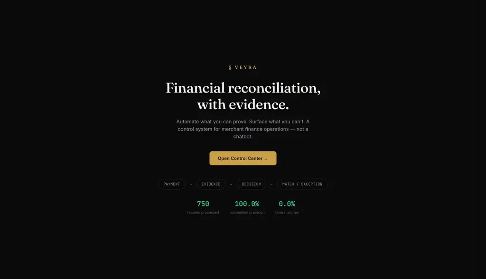
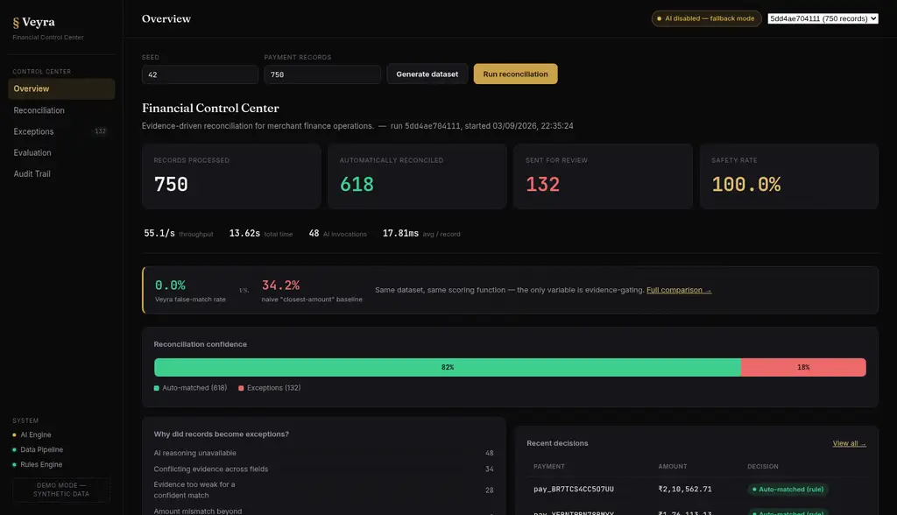
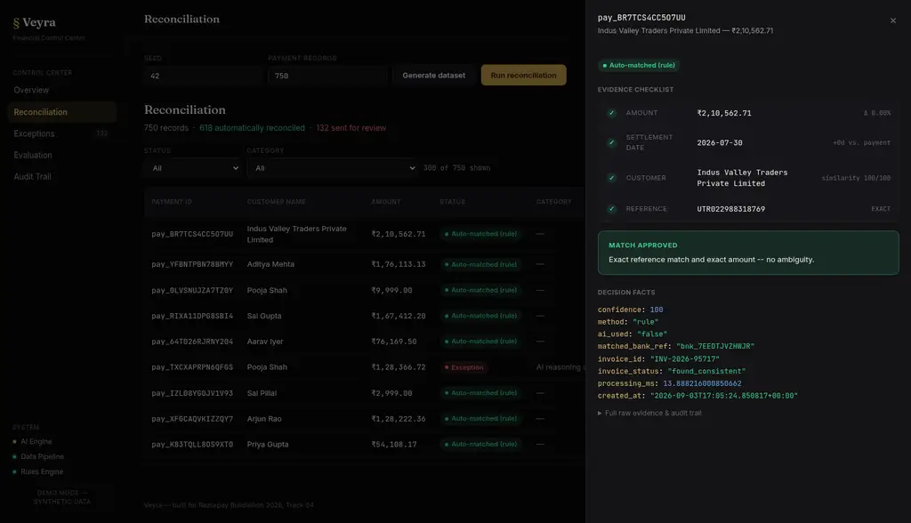
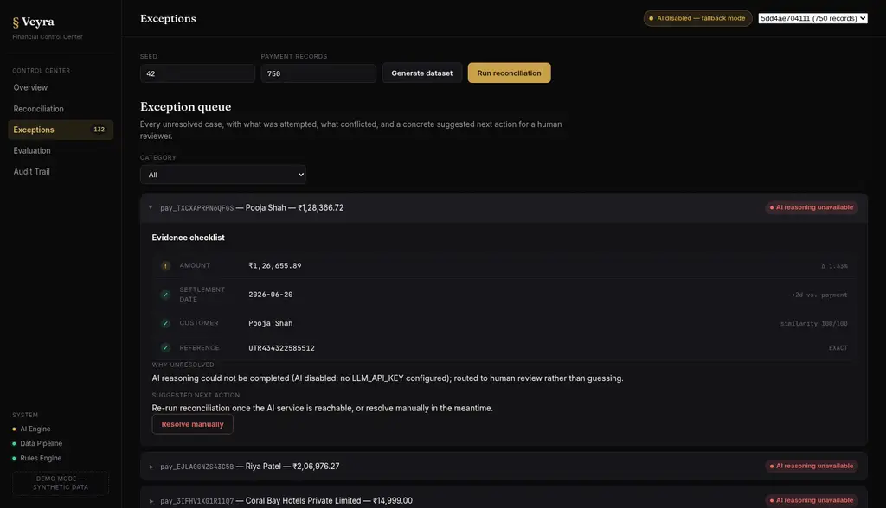
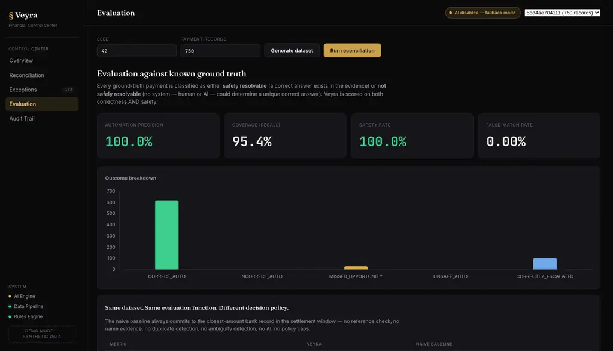
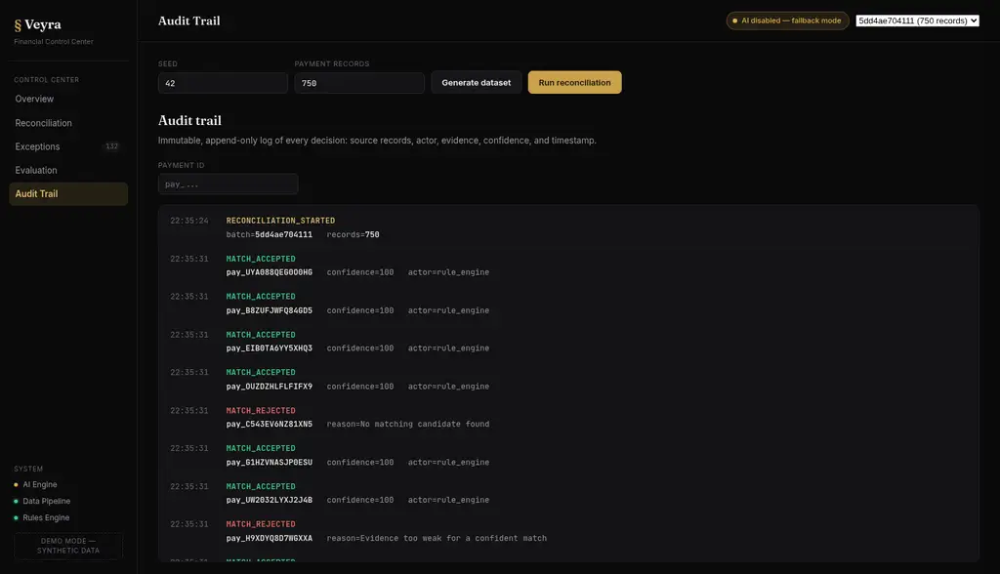

<div align="center">

# 🧾 Veyra

### AI Finance Controller — multi-source financial reconciliation with evidence-gated automation

*"We automate the financial decisions we can support with evidence, explain those decisions, and safely surface the ones we cannot."*

**Built for Razorpay Buildathon 2026 — Track 04**


</div>

---

## What this is

Veyra reconciles **payment gateway transactions** against **bank settlement records**, using **internal invoices** as corroborating evidence — the classic, high-stakes fintech-ops problem. It is not a chatbot wrapper: deterministic rules make every decision that can be established from facts alone (amounts, dates, references, duplicates); an LLM is consulted only for the minority of genuinely ambiguous cases; and a non-negotiable **policy layer** re-validates every AI proposal before it can become a financial decision. Anything that isn't safely resolvable becomes a structured, explainable exception instead of a guess.

The core bet: **a false financial match is more costly than an unresolved one.** Every design decision optimizes for that.

<p align="center">
  
</p>

## Why it stands out

Most reconciliation demos show automation. Veyra shows automation **and proves it's safe** with a measured comparison against a naive baseline, scored by the exact same evaluation function on the exact same data:

| Metric | Veyra | Naive "closest-amount match" baseline |
|---|---:|---:|
| Automation precision | **100.0%** | 65.8% |
| Coverage / recall | **95.4%** | 75.5% |
| Safety rate (correctly refuses the unresolvable) | **100.0%** | 6.9% |
| False-match rate | **0.0%** | 34.2% |

A naive fuzzy-matcher is confidently *wrong* more than a third of the time it automates. Veyra automates 82.4% of a 750-record batch with **zero** false or unsafe matches — and shows its work for every single one. See it live in the [Evaluation view](docs/screenshots/evaluation.png).

The frontend is a deliberate choice, not an afterthought: no Streamlit, no default component-library theme, no purple AI-gradient hero. It's a hand-built static UI (`web/`, vanilla HTML/CSS/JS, zero build step) styled as a financial control room -- a warm near-black "audit ledger" palette, a serif display face for headings, monospace for every number and identifier -- because a finance-control product should look like one. The centerpiece is the **evidence checklist**: click any decision and see amount / date / customer / reference each marked ✓ / ! / ✕ against the actual thresholds the engine used, with a plain-language verdict ("Automation blocked" or "Match approved") underneath -- not a raw JSON dump.


## Table of contents

- [Architecture](#architecture)
- [How reconciliation works](#how-reconciliation-works)
- [How the AI is used (and constrained)](#how-the-ai-is-used-and-constrained)
- [The synthetic dataset](#the-synthetic-dataset)
- [Evaluation methodology](#evaluation-methodology)
- [Actual measured results](#actual-measured-results)
- [Screenshots](#screenshots)
- [How to run](#how-to-run)
- [Recommended demo flow](#recommended-demo-flow-4-minutes)
- [Known limitations](#known-limitations)
- [Repo layout](#repo-layout)

## Architecture

```
data/generate_dataset.py        synthetic 3-source dataset + ground truth (seeded, reproducible)
        |
        v
app/ingestion.py                CSV -> SQLite, validates required fields, never silently coerces bad data
        v
app/normalization.py            pure functions: name/ref normalization, amount/date parsing, fuzzy similarity
        v
app/candidates.py               blocking (settlement window + amount tolerance + name/ref trace) -> candidates
        v
app/scoring.py                  deterministic decision tree: AUTO_MATCH / NEEDS_AI / EXCEPTION
        v
app/ai_reasoning.py  ----\      LLM call, ONLY for genuinely ambiguous candidates; narrow, structured I/O
        v                 \
app/policy.py                   hard guardrails on AI output (confidence floor, amount-mismatch cap,
        v                       candidate-set membership) -- AI can propose, never unilaterally decide
app/exceptions.py                structures every unresolved case for a human reviewer
        v
app/pipeline.py                 orchestrates the above, persists decisions/audit_log/exceptions to SQLite
        v
app/evaluation.py               scores decisions against ground truth (never seen by the engine itself)
app/baseline.py                 naive-matcher comparison, scored with the identical function
        v
app/api.py (FastAPI)  <-----> web/ (static HTML/CSS/JS frontend, zero build step)
```

Every box is a small, independently-testable module. No queues, no vector DB, no agent framework, no frontend build pipeline — a single SQLite file and ~12 focused Python modules are enough to make the guarantees above hold at 750+ records/run.

**Why this workflow:** multi-source reconciliation is the highest-leverage finance-ops workflow to automate *safely* — the cost of a false match (money reconciled against the wrong transaction) is much higher than the cost of a delayed review, so the entire design optimizes for **precision and safety over raw automation rate**.

**Why a hand-built frontend instead of Streamlit:** Streamlit is excellent for internal tools but every Streamlit app shares the same sidebar-plus-widgets skeleton and default theme -- instantly recognizable, and forgettable in a room full of hackathon demos. `web/` is vanilla HTML/CSS/JS (no React, no bundler, no npm install) that talks to the same FastAPI backend over `fetch()`: a landing screen with live numbers, a fixed control-room sidebar (Overview / Reconciliation / Exceptions / Evaluation / Audit Trail + a system-status panel), and a slide-over **evidence checklist drawer** -- amount/date/customer/reference each marked ✓/!/✕ against the engine's actual thresholds, with a plain-language verdict -- instead of a raw `st.json()` dump.

## How reconciliation works

1. **Candidate generation** (`app/candidates.py`): for each payment, find bank-settlement rows within the settlement window (default 0–7 days) and amount tolerance (15%), OR with a strong reference trace regardless of amount (so a mismatched-amount fraud/error case still surfaces instead of vanishing). A minimum name-similarity floor keeps two unrelated customers who coincidentally pay the same round amount from looking like false candidates for each other.
2. **Duplicate collapsing**: candidates sharing a UTR (a genuine bank double-post) are collapsed to one canonical candidate before scoring, so a duplicate bank row is flagged, not double-counted or confused with real ambiguity.
3. **Deterministic decision tree** (`app/scoring.py`): candidates are split into *plausible* (strong reference match, or a solid amount+name combination) and *noise* (coincidental amount match with no other supporting evidence). A single dominant plausible candidate with an exact reference and exact amount is auto-matched with zero AI involvement. Everything else either has a clear disqualifying reason (amount mismatch too large, reference matches but amount conflicts, no candidate at all) or is genuinely ambiguous.
4. **AI-assisted reasoning** (`app/ai_reasoning.py`): only genuinely ambiguous cases reach the LLM (~6% of this dataset). It receives the payment and the *full* plausible candidate set with precomputed features (amount diff, date diff, reference-match type, name similarity) — never raw instructions to "guess". It must return structured JSON: a decision, a candidate id (or none), a confidence score, and reasoning.
5. **Policy guardrails** (`app/policy.py`) — the core safety boundary: an AI "MATCH" is only honored if (a) the candidate id it names is actually in the evaluated set, (b) its self-reported confidence clears a threshold (75/100), and (c) the amount mismatch of the chosen candidate is under a hard cap (8%) that **no confidence score can override**. Fail any check → explicit exception, never a downgraded guess.
6. **Exception management** (`app/exceptions.py`): every unresolved case records what was attempted, what evidence was found (including rejected candidates), what conflicted, why it couldn't be resolved, and a concrete suggested next action for a human reviewer.
7. **Audit trail** (SQLite `audit_log` table): every decision — matched or excepted — gets an immutable record of the source payment, the actor (rule engine / AI-assisted / policy guardrail / validator), the evidence, the confidence, and a timestamp.
8. **Invoice corroboration**: independent of the bank-match decision, each payment is checked against the invoice ledger (by order id + amount tolerance) as secondary evidence, reported per-decision as `found_consistent` / `found_mismatch` / `not_found`.

## How the AI is used (and constrained)

- **Scope**: only the ambiguous minority of records reach the LLM. Facts (amounts, dates, duplicate IDs, thresholds) are always deterministic.
- **Input**: the LLM sees precomputed, trustworthy features — not raw data it has to re-derive — and is explicitly instructed to decline (`NO_MATCH`) when evidence is contested or no candidate stands out.
- **Output contract**: strict JSON (`decision`, `candidate_id`, `confidence`, `reasoning`, `risk_flags`), parsed and validated before use.
- **Failure handling**: no API key, a timeout, a network error, or malformed JSON all produce the same outcome — an explicit `AI_UNAVAILABLE` exception, routed to human review. The pipeline never falls back to guessing, and it never crashes.
- **No unilateral authority**: every AI "MATCH" is re-verified by `app/policy.py` against hard, non-negotiable caps. A confident-but-wrong AI proposal is downgraded to an `UNSUPPORTED_AI_DECISION` exception, not silently accepted.

## The synthetic dataset

`data/generate_dataset.py` produces three sources (`payments.csv`, `bank_settlements.csv`, `invoices.csv`) plus `ground_truth.csv`, all derived from a single seeded `random.Random` instance and a fixed anchor date — fully reproducible (`--seed 42 --size 750` regenerates byte-identical output).

14 case types are deliberately generated, each with a documented judgment on whether a correct answer is even determinable from the evidence (`is_safely_resolvable`):

| Case type | Share | Safely resolvable? |
|---|---|---|
| exact_match | 38% | yes |
| name_variation, abbreviation, formatting_diff | 20% | yes |
| settlement_delay (3–7 day lag) | 8% | yes |
| reference_variation (truncated/garbled ref) | 6% | yes |
| duplicate_bank_record (bank double-post) | 4% | yes |
| amount_mismatch_small (≤2%, fee-like) | 3% | yes |
| missing_invoice | 4% | yes (bank-match only) |
| missing_fields (blank field / corrupt amount) | 4% | mostly yes, corrupt-amount rows no |
| amount_mismatch_large (>15%, no explanation) | 3% | **no** |
| missing_bank_record (never settled) | 4% | **no** |
| ambiguous_multiple_candidates (2 indistinguishable) | 4% | **no** |
| conflicting_evidence (ref matches, amount wildly off) | 2% | **no** |

Ground truth is **never read by the reconciliation engine** — only by `app/evaluation.py`, after the fact.

## Evaluation methodology

Every ground-truth payment is classified along two independent axes: whether the system automated it (`AUTO_MATCH`/`AI_ASSISTED_MATCH`) or excepted it, and whether a correct answer was actually determinable at all. This yields five outcomes:

- **CORRECT_AUTO** — resolvable, matched, correct. The desired outcome.
- **INCORRECT_AUTO** — resolvable, matched, but the *wrong* record. A false match on a solvable case.
- **UNSAFE_AUTO** — *not* resolvable, but the system matched anyway. A safety violation, worse than INCORRECT_AUTO.
- **MISSED_OPPORTUNITY** — resolvable, but excepted instead of automated. Safe, but a coverage loss.
- **CORRECTLY_ESCALATED** — not resolvable, correctly excepted.

From these: **automation precision** = `CORRECT_AUTO / (CORRECT_AUTO + INCORRECT_AUTO + UNSAFE_AUTO)`; **coverage/recall** = `CORRECT_AUTO / resolvable_total`; **safety rate** = `CORRECTLY_ESCALATED / unresolvable_total`; **false-match rate** = `(INCORRECT_AUTO + UNSAFE_AUTO) / automated`. Throughput and per-record latency are wall-clock measured around the actual batch run, not estimated. The same scoring function (`app/evaluation.py:score_decisions`) is reused to score the naive baseline, so the two are directly comparable.

## Actual measured results

750 payments, 764 bank settlement rows, 757 invoices, seed 42, **AI disabled** (no `LLM_API_KEY` configured in this environment — the honest, reproducible baseline):

| Metric | Value |
|---|---|
| Automation precision | **100.0%** (0 incorrect, 0 unsafe auto-matches out of 618) |
| Coverage / recall | **95.4%** of the 648 safely-resolvable cases automated |
| Safety rate | **100.0%** (all 102 genuinely unresolvable cases correctly excepted) |
| False-match rate | **0.0%** |
| Auto-reconciled (rule) | 618 / 750 (82.4%) |
| Exceptions | 132 / 750, all correctly explained with evidence + suggested action |
| Throughput | ~35–65 records/sec on a single core (~15–28 ms/record, incl. SQLite writes) |
| Total batch time | ~12–21 s for 750 records |

With AI reasoning enabled (verified via a scripted stand-in LLM, since no live API key is available in this build environment — see [Known limitations](#known-limitations)), the 48 AI-eligible cases (reference variations, small amount mismatches, weak-name-but-exact-amount cases) are largely recovered: coverage rises to ~99% while precision and safety remain at 100%, because the policy layer's hard 8% amount-mismatch cap and confidence floor hold regardless of how confident the AI is. The categories that *must never* auto-resolve (`amount_mismatch_large`, `missing_bank_record`, `conflicting_evidence`, `ambiguous_multiple_candidates` — 102 records) were correctly escalated in every run, with and without AI.

### Naive baseline comparison (`app/baseline.py`, `GET /baseline`, `python cli.py baseline`)

To make the value of evidence-gating measurable rather than asserted, a naive baseline is scored with the *identical* evaluation function against the *identical* dataset: it always commits to the closest-amount bank record within the settlement window — no reference check, no name evidence, no duplicate detection, no ambiguity detection, no AI, no policy caps. The naive matcher is confidently wrong more than a third of the time it automates, and correctly refuses only 6.9% of the cases it genuinely cannot resolve — vs. 100% for Veyra, on the same 750 records.

## Screenshots

| Landing | Overview |
|---|---|
|  |  |

| Evidence checklist (decision drawer) | Exception queue |
|---|---|
|  |  |

| Evaluation vs. naive baseline | Audit trail (terminal log) |
|---|---|
|  |  |

## How to run

```bash
git clone https://github.com/Vishnu-3727/Veyra---FIntech.git
cd Veyra---FIntech
./run.sh
```

This creates a virtualenv on first run, installs dependencies, copies `.env.example` to `.env` if missing, starts the API on `:8000`, and serves the static frontend on `:8501`. Open **http://127.0.0.1:8501**.

`run.sh` is idempotent and safe to re-run: if an API from a previous `./run.sh` is still alive and healthy on the same port, it's reused instead of failing with "address already in use"; a genuine port conflict fails fast with a clear message (`API_PORT=8001 ./run.sh` / `DASHBOARD_PORT=8502 ./run.sh` to work around it).

To enable live AI reasoning, put a real key in `.env` before running:
```
LLM_API_KEY=sk-...
LLM_BASE_URL=https://api.openai.com/v1     # or any OpenAI-compatible endpoint
LLM_MODEL=gpt-4o-mini
```
Without a key the system runs in fully-functional fallback mode — ambiguous cases become explicit `AI_UNAVAILABLE` exceptions instead of being guessed.

**Manual / CLI alternative** (no dashboard):
```bash
source .venv/bin/activate
python cli.py generate --seed 42 --size 750   # synthetic dataset -> data/raw/
python cli.py run                              # ingest + reconcile, prints metrics JSON
python cli.py evaluate                         # score the latest run against ground truth
python cli.py baseline                         # naive-matcher comparison on the same data
```

**API directly** (with `run.sh` or `uvicorn app.api:app --port 8000` already running):
```bash
curl -X POST 'localhost:8000/dataset/generate?seed=42&size=750'
curl -X POST 'localhost:8000/reconcile/run'
curl 'localhost:8000/runs/latest'
curl 'localhost:8000/runs/<run_id>/evaluation'
curl 'localhost:8000/exceptions?run_id=<run_id>'
curl 'localhost:8000/decisions/<payment_id>?run_id=<run_id>'
curl 'localhost:8000/baseline'
```

**Tests**: `PYTEST_DISABLE_PLUGIN_AUTOLOAD=1 pytest tests/ -v` (the env-var works around unrelated third-party pytest plugins that may be globally installed on the host; it is not required in a clean environment).

## Recommended demo flow (~4 minutes)

1. **Landing screen** first — real live numbers (records processed, precision, false-match rate), not placeholders, before you even click in.
2. **Overview**: four hero numbers, a reconciliation-confidence bar, ranked exception reasons, recent decisions — judges understand the system in the first 10 seconds.
3. **Generate a fresh dataset live** (Generate dataset → Run reconciliation) to prove it isn't canned — ~13–20 seconds for 750 records.
4. **Reconciliation view**: open an `exact_match` payment → the evidence checklist shows amount/date/customer/reference all ✓, verdict "Match approved."
5. **Same view, an exception**: open a `conflicting_evidence` case — reference ✓ but amount ✕ (28% off) — verdict "Automation blocked," with the exact reason. This is the core "safe refusal" moment. Click **Resolve manually** to show a human reviewer action that's real (persisted via `POST /exceptions/{id}/resolve`), not decorative.
6. **If an LLM key is configured**: run again and show an `AI_ASSISTED_MATCH` decision's checklist and reasoning; then show `evaluation.per_case_type.amount_mismatch_small` improve from `MISSED_OPPORTUNITY` to `CORRECT_AUTO`.
7. **Evaluation**: the outcome chart — zero red (`INCORRECT_AUTO`/`UNSAFE_AUTO`) bars — then the baseline comparison table: 34.2% vs. 0.0% false-match rate, same data, same scoring. The single most convincing screen for judges.
8. **Audit Trail**: filter by the payment_id shown earlier — a terminal-style log line explaining the decision, actor, and evidence.

## Known limitations

- **No live LLM verified in this build environment.** `app/ai_reasoning.py` is fully implemented against the OpenAI-compatible chat completions API and unit-tested (`tests/test_policy.py`) against synthetic AI responses covering match/no-match/hallucinated-candidate/low-confidence/over-the-cap scenarios, but end-to-end behavior with a real model has not been observed in this environment. Add a key to `.env` (`LLM_API_KEY`) to exercise it live — any OpenAI-compatible endpoint works.
- **Invoice corroboration is a secondary signal**, keyed on exact `order_id`, not a second full reconciliation pass. It is reported per-decision but does not gate the primary bank-match status.
- **Single-process, single-machine.** No horizontal scaling; SQLite is sufficient at this volume (750–~20k records ingest/reconcile in seconds) but would need to move to a real database well before six-figure batch sizes.
- **Blocking thresholds are dataset-tuned.** `config.py` centralizes every threshold; they were tuned against this synthetic distribution and would need re-validation against a materially different real-world amount/name distribution.

## Repo layout

```
config.py                  every threshold and env var, centralized
cli.py                     CLI: generate / run / evaluate / baseline
run.sh                     one-command launch (API + dashboard)
data/generate_dataset.py   seeded synthetic dataset + ground truth generator
app/
  ingestion.py             CSV -> SQLite, validation
  normalization.py         name/ref normalization, amount/date parsing, fuzzy similarity
  candidates.py            candidate generation + duplicate detection
  scoring.py               deterministic decision tree
  ai_reasoning.py          LLM client, narrow scope, graceful degradation
  policy.py                hard guardrails on AI output
  exceptions.py            structured exception detail + suggested actions
  pipeline.py              orchestration + persistence
  evaluation.py            ground-truth scoring
  baseline.py              naive-matcher comparison
  api.py                   FastAPI service
web/                      static frontend: index.html, styles.css, app.js (zero build step)
tests/                     policy guardrail + ingestion robustness tests
```

## Remaining high-value improvements

- Verify live-LLM behavior end-to-end and tune the confidence threshold against real model calibration.
- A second reconciliation pass keyed on invoice-side discrepancies (currently one-directional: payment → invoice, not invoice → payment for orphaned invoices).
- A "resolve exception" workflow in the dashboard (mark reviewed / record human decision) — currently read-only, an explicit scope cut to protect the core pipeline.

---

<div align="center">
<sub>Built in ~3 days for Razorpay Buildathon 2026, Track 04: AI Finance Controller.</sub>
</div>
